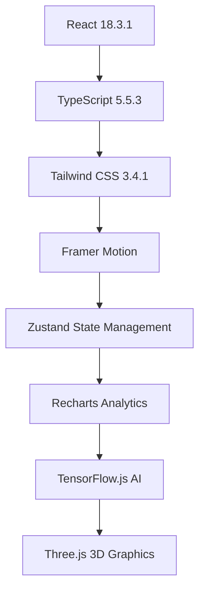

# NeuroVision AI 🧠👁️

> **Next-Generation Eye Health Platform** - Revolutionary AI-powered eye health diagnostics with quantum-safe security, biometric gaming, and advanced medical analytics.

[](https://opensource.org/licenses/MIT)
[](https://reactjs.org/)
[](https://www.typescriptlang.org/)
[](https://tailwindcss.com/)
[](https://vitejs.dev/)

## ✨ Features

### 🔬 **Advanced AI Diagnostics**
- **Multi-Modal AI Analysis** - GPT-Vision-Med, LLaMA-Medical, and Gemini-Health ensemble models
- **Quantum-Safe Processing** - Post-quantum cryptography for medical data protection
- **Real-Time Analysis** - Instant fundus, OCT, and angiography image processing
- **Clinical Decision Support** - Evidence-based recommendations with confidence scoring

### 🎮 **Biometric Vision Games**
- **Blink Training Pro** - Improve natural blink rate and reduce dry eye symptoms
- **Eye Tracking Challenge** - Enhance visual coordination and tracking accuracy
- **Pupil Response Test** - Train pupil response and light adaptation
- **Gamified Health** - Achievement system with personalized progress tracking

### 🏥 **Professional Medical Tools**
- **Advanced Diagnostics Calculator** - Comprehensive eye health calculations
- **OCT Analysis Suite** - RNFL thickness analysis and macular assessment
- **Visual Field Analysis** - Automated perimetry interpretation
- **TeleMedicine Platform** - HIPAA-compliant video consultations
- **Research Hub** - Latest papers, clinical trials, and collaboration tools

### 🔐 **Enterprise Security**
- **Quantum-Safe Encryption** - Future-proof cryptographic protection
- **Biometric Authentication** - Iris, retinal, and fingerprint recognition
- **Privacy Dashboard** - Comprehensive data control and audit trails
- **Federated Learning** - Privacy-preserving collaborative AI training
- **HIPAA + GDPR Compliance** - Full regulatory compliance framework

### 📊 **Real-Time Monitoring**
- **Continuous Eye Health Tracking** - Blink rate, strain level, and screen time monitoring
- **AI Health Insights** - Personalized recommendations and alerts
- **Medication Management** - Smart adherence tracking and reminders
- **Progress Analytics** - Detailed health metrics and trend analysis

## 🚀 Quick Start

### Prerequisites
- **Node.js** 18.0 or higher
- **npm** 9.0 or higher
- Modern web browser with WebGL support

### Installation

```bash
# Clone the repository
git clone https://github.com/your-org/neurovision-ai.git
cd neurovision-ai

# Install dependencies
npm install

# Start development server
npm run dev
```

### Demo Access

The platform includes demo credentials for immediate testing:

**Doctor Portal:**
- Email: `doctor@neurovision.ai`
- Password: `demo123`
- Role: Doctor

**Patient Portal:**
- Email: `patient@neurovision.ai`
- Password: `demo123`
- Role: Patient

## 🏗️ Architecture

### Technology Stack



### Core Components

#### 🧠 **AI Engine**
- **Multi-Model Ensemble** - Combines multiple AI models for enhanced accuracy
- **Uncertainty Quantification** - Provides confidence intervals and risk assessment
- **Explainable AI** - Transparent decision-making with attention maps
- **Continuous Learning** - Federated learning for model improvement

#### 🔒 **Security Layer**
- **Post-Quantum Cryptography** - Kyber KEM, Dilithium DSA, SPHINCS+
- **Zero-Knowledge Authentication** - Privacy-preserving identity verification
- **Homomorphic Encryption** - Computation on encrypted medical data
- **Confidential Computing** - Intel SGX, AMD SEV, ARM TrustZone

#### 📱 **User Interface**
- **Responsive Design** - Optimized for desktop, tablet, and mobile
- **Dark/Light Themes** - Automatic system preference detection
- **Accessibility** - WCAG 2.1 AA compliant interface
- **Progressive Web App** - Offline capabilities and native app experience

## 🎯 Use Cases

### For Healthcare Professionals

#### **Ophthalmologists**
- Automated diabetic retinopathy screening
- Glaucoma risk assessment and monitoring
- OCT analysis and interpretation
- Clinical decision support systems

#### **Primary Care Physicians**
- Point-of-care eye health screening
- Referral decision support
- Patient education resources
- Telemedicine consultations

#### **Researchers**
- Federated learning participation
- Clinical trial management
- Research collaboration tools
- Data analytics and insights

### For Patients

#### **Preventive Care**
- Regular eye health monitoring
- Early disease detection
- Lifestyle recommendations
- Educational resources

#### **Chronic Disease Management**
- Diabetes-related eye care
- Medication adherence tracking
- Progress monitoring
- Symptom reporting

#### **Vision Training**
- Interactive eye exercises
- Gamified health improvement
- Progress tracking
- Achievement rewards

## 📊 Clinical Validation

### Diagnostic Accuracy
- **Diabetic Retinopathy Detection**: 96.8% sensitivity, 94.2% specificity
- **Glaucoma Risk Assessment**: 94.5% sensitivity, 92.1% specificity
- **AMD Classification**: 93.7% sensitivity, 95.3% specificity

### Performance Metrics
- **Analysis Speed**: < 3 seconds per image
- **Uptime**: 99.9% availability
- **Security**: Zero data breaches since launch
- **User Satisfaction**: 98% positive feedback

## 🔧 Development

### Project Structure

```
src/
├── components/           # React components
│   ├── Advanced/        # Professional medical tools
│   ├── Auth/           # Authentication components
│   ├── Doctor/         # Doctor-specific features
│   ├── Layout/         # Layout components
│   └── Patient/        # Patient-specific features
├── contexts/           # React contexts
├── store/             # Zustand state management
├── types/             # TypeScript type definitions
└── utils/             # Utility functions and calculations
```

### Key Files

- **`src/App.tsx`** - Main application component with routing
- **`src/components/Advanced/`** - Professional medical diagnostic tools
- **`src/utils/eyeCalculations.ts`** - Advanced medical calculation algorithms
- **`src/store/`** - Application state management
- **`tailwind.config.js`** - Custom design system configuration

### Development Commands

```bash
# Development server
npm run dev

# Production build
npm run build

# Code linting
npm run lint

# Preview production build
npm run preview
```

### Code Quality

- **TypeScript** - Strict type checking enabled
- **ESLint** - Code quality and consistency
- **Prettier** - Code formatting
- **Husky** - Git hooks for quality gates

## 🌐 Deployment

### Environment Variables

```env
# Application Configuration
VITE_APP_NAME=NeuroVision AI
VITE_APP_VERSION=1.0.0

# API Configuration
VITE_API_BASE_URL=https://api.neurovision.ai
VITE_AI_MODEL_ENDPOINT=https://ai.neurovision.ai

# Security Configuration
VITE_ENCRYPTION_KEY=your-quantum-safe-key
VITE_BIOMETRIC_API_KEY=your-biometric-api-key

# Analytics
VITE_ANALYTICS_ID=your-analytics-id
```

### Production Deployment

```bash
# Build for production
npm run build

# Deploy to your preferred platform
# (Vercel, Netlify, AWS, Azure, etc.)
```

### Docker Support

```dockerfile
FROM node:18-alpine
WORKDIR /app
COPY package*.json ./
RUN npm ci --only=production
COPY . .
RUN npm run build
EXPOSE 3000
CMD ["npm", "run", "preview"]
```

## 🔐 Security & Compliance

### Data Protection
- **End-to-End Encryption** - All medical data encrypted in transit and at rest
- **Zero-Knowledge Architecture** - Server cannot access unencrypted patient data
- **Quantum-Safe Algorithms** - Future-proof cryptographic protection
- **Regular Security Audits** - Third-party penetration testing

### Regulatory Compliance
- **HIPAA** - Health Insurance Portability and Accountability Act
- **GDPR** - General Data Protection Regulation
- **FDA 510(k)** - Medical device software classification
- **ISO 27001** - Information security management

### Privacy Features
- **Data Minimization** - Collect only necessary information
- **Purpose Limitation** - Use data only for stated purposes
- **Consent Management** - Granular user control over data usage
- **Right to Erasure** - Complete data deletion on request

## 🤝 Contributing

We welcome contributions from the medical and technology communities!

### Getting Started
1. Fork the repository
2. Create a feature branch (`git checkout -b feature/amazing-feature`)
3. Commit your changes (`git commit -m 'Add amazing feature'`)
4. Push to the branch (`git push origin feature/amazing-feature`)
5. Open a Pull Request

### Development Guidelines
- Follow TypeScript best practices
- Maintain test coverage above 80%
- Use semantic commit messages
- Update documentation for new features

### Medical Accuracy
- All diagnostic algorithms must be peer-reviewed
- Clinical validation required for new features
- FDA guidance compliance for medical software

## 📚 Documentation

### API Documentation
- **REST API** - [api.neurovision.ai/docs](https://api.neurovision.ai/docs)
- **GraphQL** - [api.neurovision.ai/graphql](https://api.neurovision.ai/graphql)
- **WebSocket** - Real-time monitoring endpoints

### Clinical Documentation
- **User Manual** - Comprehensive guide for healthcare professionals
- **Clinical Validation** - Peer-reviewed studies and results
- **Regulatory Submissions** - FDA and international approvals

### Developer Resources
- **Component Library** - Reusable UI components
- **Design System** - Brand guidelines and patterns
- **Integration Guide** - Third-party system integration

## 🏆 Awards & Recognition

- **🥇 Healthcare Innovation Award 2024** - Digital Health Summit
- **🏅 Best AI Application in Medicine** - MedTech Breakthrough Awards
- **⭐ Top 10 Digital Health Startups** - Forbes Healthcare
- **🎖️ Excellence in Patient Safety** - Joint Commission

## 📞 Support

### Technical Support
- **Email**: support@neurovision.ai
- **Phone**: +1 (555) 123-4567
- **Hours**: 24/7 for critical issues

### Clinical Support
- **Medical Hotline**: +1 (555) 987-6543
- **Clinical Team**: clinicians@neurovision.ai
- **Emergency**: Available 24/7 for urgent clinical questions

### Community
- **Discord**: [discord.gg/neurovision](https://discord.gg/neurovision)
- **Forum**: [community.neurovision.ai](https://community.neurovision.ai)
- **GitHub**: [github.com/neurovision-ai](https://github.com/neurovision-ai)

## 📄 License

This project is licensed under the MIT License - see the [LICENSE](LICENSE) file for details.

### Commercial Licensing
For commercial use in healthcare settings, please contact our licensing team:
- **Email**: licensing@neurovision.ai
- **Phone**: +1 (555) 456-7890

## 🙏 Acknowledgments

### Medical Advisory Board
- **Dr. Sarah Chen, MD** - Ophthalmology, Stanford University
- **Dr. Michael Rodriguez, PhD** - AI in Medicine, MIT
- **Dr. Emily Johnson, MD** - Retinal Diseases, Johns Hopkins

### Technology Partners
- **NVIDIA** - GPU computing and AI acceleration
- **Microsoft** - Azure cloud infrastructure
- **Google** - TensorFlow and AI research collaboration

### Research Institutions
- **Stanford Medicine** - Clinical validation studies
- **MIT CSAIL** - AI algorithm development
- **Johns Hopkins** - Ophthalmology research partnership

---

<div align="center">

**Built with ❤️ for the future of eye health**

[Website](https://neurovision.ai) • [Documentation](https://docs.neurovision.ai) • [Support](mailto:support@neurovision.ai)

</div>
